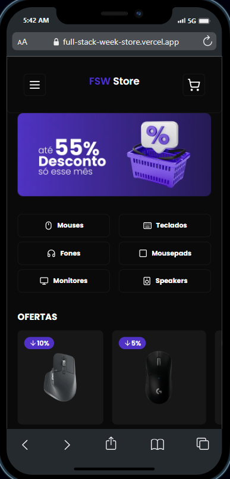

<h1 align="center"> 🛒 FSW Store 🛒 </h1>

Welcome to FullStack Week Store!
  This project consists of an online store for peripherals such as mice, keyboards, monitors, etc.

  <a href="#technologies">Technologies</a>&nbsp;&nbsp;&nbsp;|&nbsp;&nbsp;&nbsp;
  <a href="#learning">What I've Learned</a>&nbsp;&nbsp;&nbsp;|&nbsp;&nbsp;&nbsp;
  <a href="#installation">Installation</a>&nbsp;&nbsp;&nbsp;|&nbsp;&nbsp;&nbsp;
  <a href="#docker">Docker Installation</a>&nbsp;&nbsp;&nbsp;|&nbsp;&nbsp;&nbsp;
  <a href="#layout">Layout</a>&nbsp;&nbsp;&nbsp;&nbsp;&nbsp;|&nbsp;&nbsp;
  <a href="#todo">To-do</a>&nbsp;&nbsp;&nbsp;

 

  

 
<h1 id='technologies'>🖱️ Technologies</h2>

This project was made with the following technologies/libraries:

- TypeScript
- NextJS 13
- Prisma
- NextAuth
- TailwindCSS
- shadcn/ui
- Lucide-react ( icons )
- Git
- Github
- Docker
 

<h1 id='learning'>🧠 What I've Learned</h2>

In this website, I worked with:

- Usage of [ContextApi](./src/providers/cart.tsx)
- shadcn/ui development
- Authentication with NextAuth
- Mobile-first approach

 

<h1 id='layout'>🖥️ Layout</h1>

 

### To make this project, I used this [Figma Design](https://www.figma.com/file/Y8jmabSZXxAobeUJQdI4bm/FSW-Store-%5BLive%5D?type=design&node-id=89-280&mode=design&t=G7dcVNXDj3n4z0wA-0).

### To see the Deploy, check [THIS LINK](https://fsw-store-psi.vercel.app/).

 

<h1 id='installation'>📤 Installation</h1>

<h3>Firstly, you need to <strong>clone the project</strong> on your machine:</h3>

git clone https://github.com/cristian-sbardelotto/fsw-store
 
<h3>After that, open the project folder and <strong>install the dependencies:</strong></h3>
npm install
# or
yarn
#or
pnpm install
<h3>To <strong>run the project</strong> on your browser, use:</h3>
npm run dev
# or
yarn dev
# or
pnpm dev
 
<h1 id='docker'>🐳 Docker Installation</h1>
<h3>If you prefer to use Docker for your development environment, follow these steps:</h3>
<h4>1. Clone the project:</h4>

git clone https://github.com/PatrickEN-dev/fsw-store.git
cd fsw-store
<h4>2. Build the Docker container:</h4>
docker build -t fsw-store .
<h4>3. Run the Docker container:</h4>
docker run -p 3000:3000 fsw-store
<h3>Your FSW Store application will be accessible at http://localhost:3000.</h3>
 
<h1 id='todo'>✅ To-Do List</h1>
<h3>
  - ✅ Mobile layout  
   
  - 🛠️ Desktop layout 
   
  - 🛠️ Profile Page  
</h3>

<h2 align='center'>Enjoy this project!</h2>

